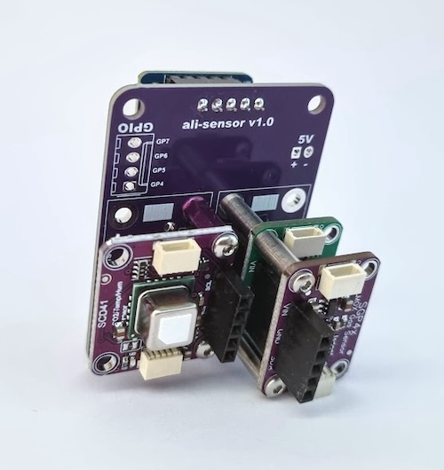
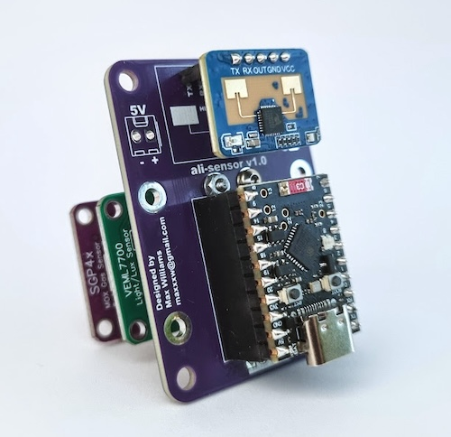
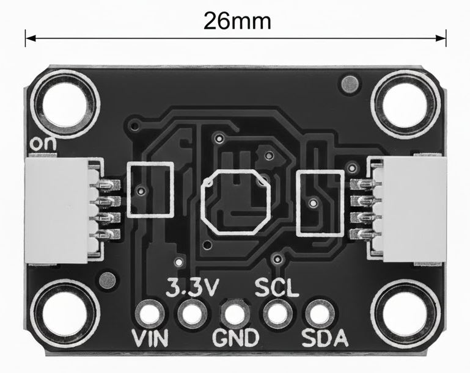

# ali-sensor

A multi-sensor device for [Home Assistant](https://www.home-assistant.io/) built around cheap parts from [AliExpress](https://aliexpress.com/). This project is essentially a [PCB design](pcb) and [ESPHome](https://esphome.io/) configuration that allows you to build a customisable device that could detect presence and measure light, CO₂, temperature, humidity, VOCs and more. You can choose a selection of sensors available from your favourite marketplace of questionable but cheap goods.

The PCB is designed around an [ESP32-C6 Super Mini](https://www.espboards.dev/esp32/esp32-c6-super-mini/) and features:

- Space for a single [HLK-LD2410C](https://www.hlktech.net/index.php?id=1095) Human Presence sensor
- 2x I2C sensor stacks where many different sensors can be connected
- 4x GPIO out
- I2C bus power selector for 3.3V or 5V
- Power connector or alternatively use the USB-C connector from the ESP32-C6

## Example build

 

This example build measures Lux, CO₂ , VOCs, NOx index, temperature, humidity, presence and motion using the following devices from AliExpress:

- ESP32-C6 Super Mini (4.90€)
- HLK-LD2410C Human Presence & Distance Detection Radar Sensor Module (3.70€)
- SGP41 VOC and NOx sensor (12€)
- SCD41 CO₂ sensor (23€)
- VEML7700 High accuracy ambient light sensor (3.85€)

Total cost is about 47€, very reasonable given that it includes high quality gas and CO₂ sensors.

## The sensors

There are a number of suitable sensors from not just AliExpress but also [Adafruit](https://www.adafruit.com/) (actually I think they created the layout/footprint of these sensors). Look for the sensors that have this 5 pin and mounting hole layout:

Some examples I have found:

- SGP41 VOC and NOx sensor (AliExpress)
- SCD41 CO₂ sensor (AliExpress)
- VEML7700 light sensor (AliExpress)
- SGP30 indoor air quality gas sensor (AliExpress)
- SHT45 Precision Temp & Humidity (Adafruit)
- Si7021 Temperature & Humidity Sensor (Adafruit)
- SHTC3 Temperature & Humidity (Adafruit)
- QMC5883P Triple axis agnetometer (Adafruit)
- MMC5603 Triple axis agnetometer (Adafruit)
- TLV493D Triple-Axis Magnetometer (Adafruit)
- MS8607 Pressure Humidity Temperature (Adafruit)

Some photos of these sensors are collected in [img/sensors](img/sensors) to make finding the correct version on AliExpress easier.
